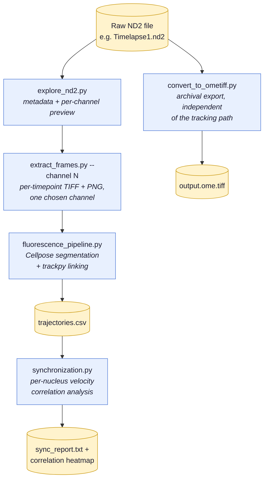

# ConfocalOrchestrator

An automated pipeline for confocal time-lapse imaging and analysis of *Physarum polycephalum*.

## Status

Early development — Stage 1 (Discovery & Setup) moving into acquisition integration. Analysis pipeline validated end-to-end against real Physarum ND2 data (`Dye Trial 1.nd2`, `Dye Trial Z1.nd2`, `Timelapse1.nd2`) — several real-data bugs were found and fixed along the way (multi-channel file crashes, wrong Cellpose model, inverted validation mask; see each script's own header comment for details). Whole-organism shape tracking (`cellects_pipeline.py`/`nd2_pipeline.py`) remains blocked on a Python ≥3.11 requirement. Hardware specs and NIS-Elements API documented (see `docs/microscope-notes.md`), first stage-connection script drafted (`acquisition/nis_connection.py`), and a real biofilm imaging protocol captured (`protocols/example_protocol.yaml`). Still pending: Remote Desktop access to the microscope PC to actually test the connection.

## About

This project automates two things that are currently done manually in the lab:

1. Running overnight imaging sessions on the Nikon Eclipse Ti2 / N-SPARC confocal microscope
2. Analysing time-lapse data — segmenting the organism and tracking growth metrics across frames

## Analysis Pipeline

The core path from a raw ND2 file to tracked, analyzed nuclei — `preprocess_nd2.py` and
`segment_nd2.py` are optional single-frame QC/sanity-check tools and aren't on this path
(see the full script table below):



All scripts accept `--file`/`--input`/`--output`-style CLI args now (run any script with no
flags to use its documented default demo file/path):

| Script | Input | Output |
|---|---|---|
| `analysis/explore_nd2.py` | ND2 file | Metadata + one preview PNG per channel |
| `analysis/extract_frames.py` | ND2 file (`--channel` for multi-channel files) | Numbered PNGs + raw TIFFs in `data/frames/` |
| `analysis/preprocess_nd2.py` | Raw frame PNG | Denoised + background-corrected + speckle-filtered frame |
| `analysis/segment_nd2.py` | Single PNG | Cellpose segmentation overlay (quick single-frame check) |
| `analysis/fluorescence_pipeline.py` | Folder of `t*.tif` frames | Per-nucleus trajectories CSV + visualisation (Cellpose + trackpy) — **the maintained tracking pipeline**; `analysis/track_nuclei.py` is deprecated in its favor (see that file's header) |
| `analysis/synchronization.py` | Trajectories CSV | Per-nucleus velocity correlation report + plots |
| `analysis/convert_to_ometiff.py` | ND2 file | OME-TIFF (pixels + metadata in one open format) |
| `analysis/cellects_pipeline.py` / `analysis/nd2_pipeline.py` | TIFF/PNG folder or ND2 file | CSV + growth curve plot — **currently blocked**: `cellects` requires Python ≥3.11, this project's venv is 3.9.25 |

Cellpose defaults to `CELLPOSE_GPU=auto`, which uses CUDA when PyTorch can see a GPU and falls back to CPU otherwise. To force GPU mode, run a script like `CELLPOSE_GPU=1 python3 analysis/segment_nd2.py`. Segmentation scripts use Cellpose's default model (not `model_type="nuclei"`) — the nuclei model was tested against real Physarum fluorescence data and found 0 detections.

**Metrics tracked per frame:** area, perimeter, circularity, eccentricity, major/minor axis length, solidity (via `cellects_pipeline.py`/`nd2_pipeline.py`, once unblocked) — or per-nucleus x/y/area trajectories (via `fluorescence_pipeline.py`).

## Data Folder Structure

```
data/
├── raw/          # ND2 files from the microscope
├── frames/       # Extracted PNG frames
├── datasets/     # Reference/validation datasets
└── analysis/     # Script outputs (CSV, plots)
```

## Project Structure

```
ConfocalOrchestrator/
├── acquisition/     # Microscope control and image capture (in progress)
│                    #   nis_connection.py — stage connection smoke test (done)
│                    #   run_protocol.py — reads a protocol YAML and runs the full
│                    #     timepoint/position/z-stack/channel loop (done, untested on real hardware)
│                    #   dashboard.py — live web dashboard (status/frame/abort), wired into
│                    #     run_protocol.py's loop so it reflects a real run (done, tested)
│                    #   focus_check.py — Laplacian-variance focus drift detection,
│                    #     the safety net for overnight runs (done, tested; not yet
│                    #     called from run_protocol.py's loop)
├── analysis/        # Preprocessing, segmentation, and tracking scripts
├── validation/      # Accuracy benchmarking
├── protocols/       # Imaging protocol files (e.g. example_protocol.yaml)
└── docs/            # Project documentation (e.g. microscope-notes.md)
```

## Tech Stack

- Python 3.13
- nd2 — read Nikon ND2 files
- Cellects — Physarum segmentation and shape tracking
- Cellpose — nucleus segmentation (comparison)
- OpenCV, NumPy, Pillow, pandas, matplotlib

## Getting Started

```bash
git clone <repo-url>
cd ConfocalOrchestrator
python3 -m venv .venv
source .venv/bin/activate
pip install -r requirements.txt
```

> Hardware integration (NIS-Elements microscope control) is underway: hardware specs, the confirmed NIS-Elements Jobs Python API, and a first stage-connection script are in place (see `docs/microscope-notes.md`). It hasn't been tested against the real microscope yet — that needs Remote Desktop access to the microscope PC, which is pending.
